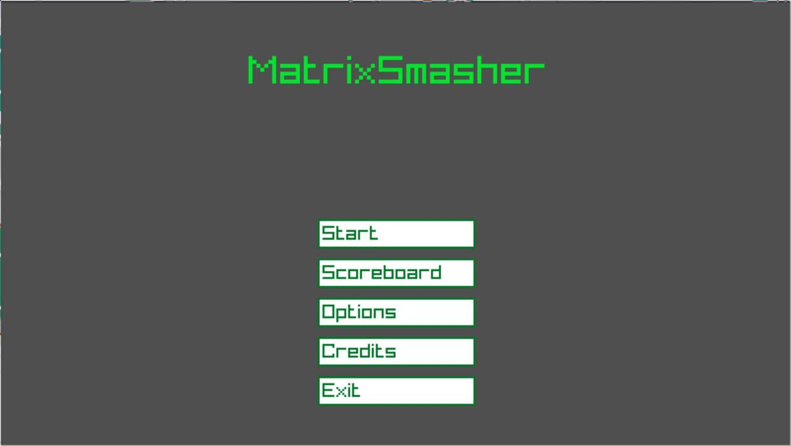
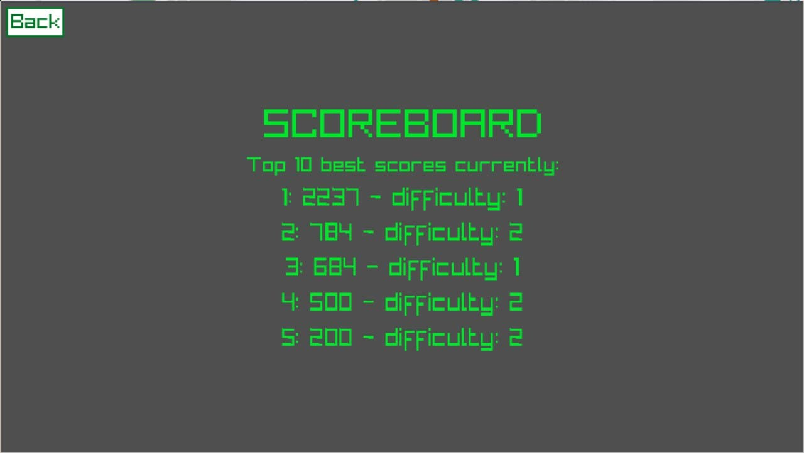
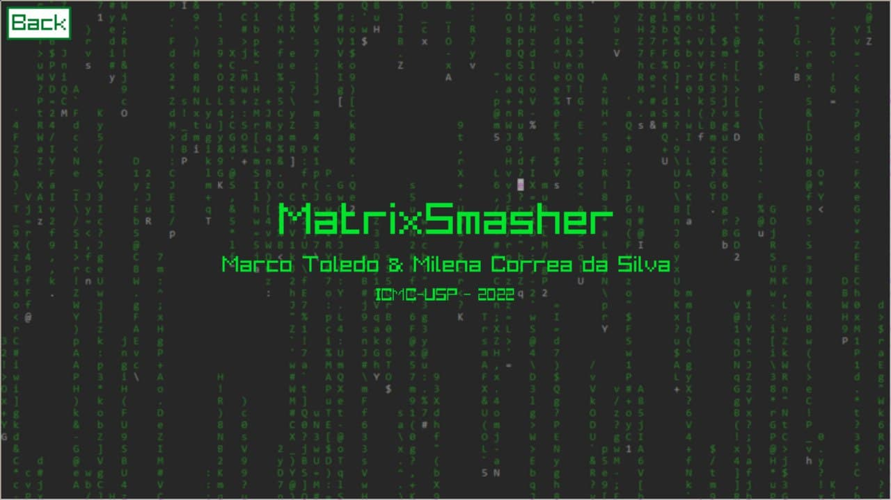
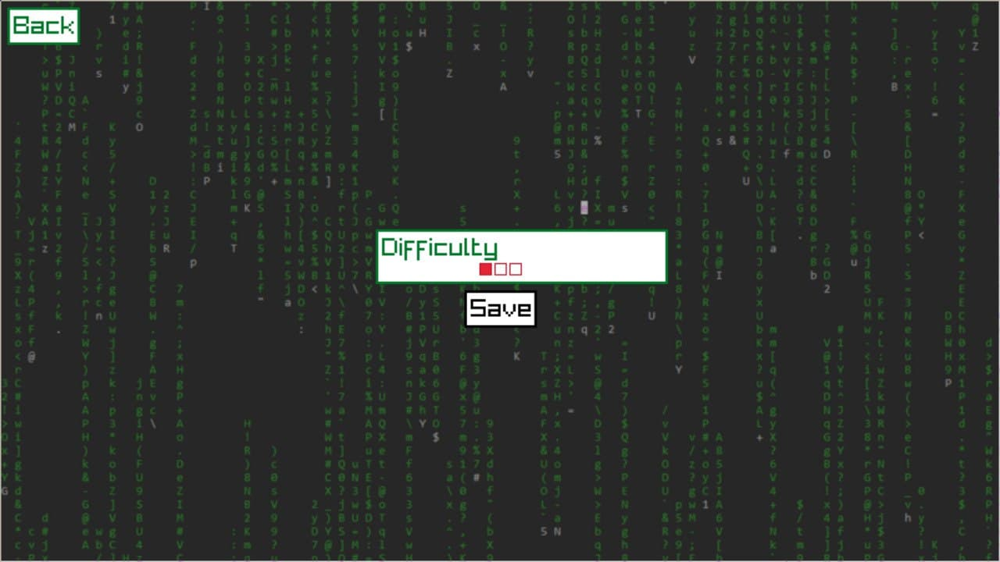
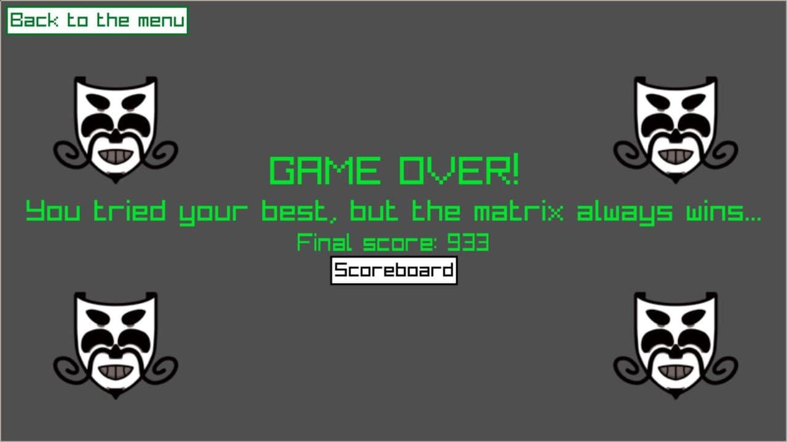

# MatrixSmasher

Após baixar arquivos pouco confiáveis na internet, o Anonymous infectou seu computador com um terrível malware.

Para retardar o progesso do vírus, você precisa digitar as palavras que aparecem na sua tela o mais rápido possível,\
enquanto ele aumenta progessivamente o velocidade de ataque. 

*Feito utilizando [raylib](https://github.com/raysan5/raylib/) e C++*

## Como jogar
Ao iniciar o jogo, digite as palavras que aparecem na sua tela o mais rápido 
possível sem deixar nenhuma passar.

* Você tem 10 vidas no total, ou seja, pode perder de vista 10 palavras.

* Cada palavra completamente correta equivale a 100 pontos.

* Conforme o jogo vai progredindo, mais palavras vão aparecendo na tela 
simultaneamente.

* A cada tecla errada (que não pode consumir nenhuma palavra na tela) 
você perde 5% dos seus pontos.

* Ao final do jogo seu score final ficará salvo no scoreboard :)

## Screenshots

<p float="left" align="center">
  
  
  
</p>
<p float="left" align="center">
   
   
</p>

## Vídeo 


## Compilação

Caso a biblioteca `raylib` ainda não esteja configurada, primeiro configure
seus objetos **estáticos** como indicado na [Wiki do projeto](https://github.com/raysan5/raylib/wiki#development-platforms) com base na sua 
plataforma a partir da cópia do `raylib` presente na pasta `./MatrixSmasher/src/raylib/`, 
submódulo referenciando a versão utilizada no jogo.

Com o raylib configurado em seu sistema, uma vez na pasta raíz do diretório
clonado (`./MatrixSmasher/`), compile todos os arquivos fonte com o comando

``` sh
make release # o compilador C++ pode ser configurado pela opção CXX, clang++ por padrão
```

e execute o executável com 

``` sh
make run
```

## Layout dos Arquivos

### **./data/**
Contêm os arquivos referentes ao player data, ou seja, os placares dos jogos
e as opções de jogo salvas. 

### **./resources/**
Contêm as imagens e arquivos de textos utilizados para configurar o jogo,
como por exemplo: os spritesheets das animações e a wordlist contendo
as palavras do jogo.

### **./src/components/**
Contêm os classes correpondentes aos componentes da UI do jogo, 
como por exemplo: botões, sliders, animações etc.

### **./src/scenes/**
Contêm as classes correpondentes as cenas do jogo, ou seja, cada uma 
das transições de tela do mesmo. 

* Menu é a cena inicial e dela podemos ir para o jogo em si, para o scoreboard,  
para os créditos, para as opções e até mesmo sair do jogo.
* As cenas de `ScoreBoard`, `Credits`, `GameOver` e `Options` nos permitem voltar para o menu do jogo. 
* As cenas, no geral, estão ligadas entre si e a transição entre elas é feita dentro
das próprias através do `shared_ptr<Scene>* curScene`. Saimos do jogo quando esse 
ponteiro se torna um `nullptr`.

#### **./src/main.cpp**
A `main` está responsável por configurar a janela que será utilizada para executar o
jogo, além conter o loop que desenha cada cena. 

Os vetores `drawStatic` e `drawStack` contêm os elementos de UI que seram desenhados a cada
iteração pela main. A única diferença entre eles é que os elementos em drawStatic não mudam
de estado e, por isso, são apenas apagados quando alteramos a cena e os em drawStack podem ser
sendo apagados e redesenhados a cada iteração do loop.

## Threads/Semáforos

### Jogo
Como nosso jogo tem uma lógica baseada no problema Produtor-Consumidor, 
a implementação principal das threads e do semáforo (no nosso caso, implicito no mutex), ficou
dentro da cena do jogo em si, criando um "pipe" assíncrono na lista de palavras:
```cpp
./src/components/Game.cpp

void Game::_feed(Game* _game) {
    // ...
    while (true) {
        // Confere fim de jogo de maneira atômica,
        // situando o acesso ao booleano com um mutex 
        // bloqueant próprio
        if (_game->stopFeed.load()) break;
        
        // ...

        {
            // Usando o mutex de wordlist (wlMutex) para 
            // inserir uma nova palavra de forma thread-safe,
            // mesmo rodando em uma thread a parte, 
            // não sincronizada, em relação ao consumidor
            lock_guard<mutex> guard{_game->wlMutex};
            _game->words.emplace(_game->availableWords.at(idx), *_game->win);
        }

        // ...

        {
            // Usando o mutex do feed de palavras (feedMutex),
            // aguarda o fim do tempo de espera ou uma 
            // notificação thread-safe de fora da thread,
            // para continuar a execução
            unique_lock<mutex> uFeed(_game->feedMutex);
            _game->conditionalFeed.wait_for(
                uFeed,
                std::chrono::milliseconds(static_cast<int>(timeout))
            );
        }
    }
    
    // ...
}

void Game::draw() {
    // ...

    decltype(words.size()) qnt;
    {
        // Leitura thread-safe to atual tamanho da fila,
        // usando o mutex de wordlist (wlMutex),
        // suficiente para o consumo seguro 
        // dos elementos já que o consumo dos elementos 
        // será feito de maneira síncrona
        lock_guard<mutex> guard{wlMutex};
        qnt = words.size();
    }
    
    // ...

    while (qnt-- > 0) {
        auto temp = words.front(); words.pop();
        
        // ...
        // Tratamento da palavra no início da fila
        // ...
        
        if (temp.getPos().y < win->GetHeight() + 15) {
            // Reinserção thread-safe da palavra ao final
            // da fila caso necessário
            lock_guard<mutex> guard(wlMutex);
            words.push(temp);
        }
    }
    
    // ...
}
```

### Animações
Utilizamos threads também para as animações, sobretudo, na hora de iterar por cada
frame no spritesheet:
```cpp
./src/components/Animation.cpp

void Animation::startLoop(bool shouldLoop) {
    auto qnt = sprite.getAmntFrames();
    animHandler = thread([&, shouldLoop, qnt] () {
        while (true) {
            {
                // Usando o mutex de parada do animador (stopMutex),
                // aguarda o fim do tempo de espera ou uma 
                // notificação thread-safe de fora da thread
                // para continuar a execução
                unique_lock<mutex> ul(stopMutex);
                conditialAnimation.wait_for(ul, std::chrono::milliseconds(frameRate));
            }
            
            // Checagem thread-safe da terminação
            // de execução, eliminando a thread
            if (stopThread.load()) break;
            
            // Animação cronometrada dos frames...
        }
    });
}

void Animation::stopLoop() {
    // Salva valor atomicamente ao indicador 
    // de fim de animação
    stopThread.store(true);
    // Notifica variável condicional do timer
    // de frames
    conditialAnimation.notify_all();
    // Retoma execução síncrona da thread de 
    // animação de frames para seu fim de execução
    // e subsequente limpeza de recursos de 
    // forma segura
    animHandler.join();
}
```

## Contributors | Participantes
<a href="https://github.com/Ocramoi"></a>
<a href="https://github.com/milenacsilva"></a>

Marco Antônio Ribeiro de Toledo  - **11796419**\
Milena Corrêa da Silva - **11795401**
